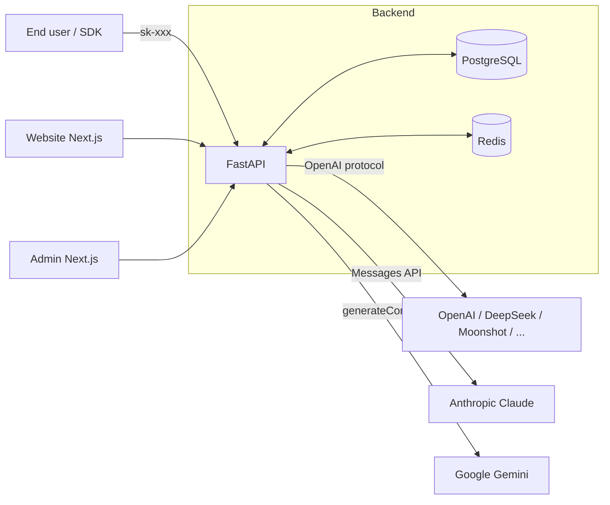

# Architecture

## Topology



## Component responsibilities

- **website**: user-facing app. Sign up / sign in, plan purchases, top up, API key management, usage & billing views.
- **admin**: admin console. User & order management, upstream channels, models & rates, plans, routing policies, stats.
- **api**: the only backend.
  - Auth: email + password + JWT; `/v1/*` requests are authenticated by the `sk-` API key.
  - **Forwarding**: exposes an OpenAI-compatible protocol; internally translates requests to the upstream's native protocol via `services/providers/*` and translates responses (including SSE) back into OpenAI format.
  - Billing: converts tokens to `cost_cents` using `models.prompt_rate / completion_rate` and deducts `users.balance_cents` inside the transaction.
  - Routing: picks a `model` from `route_policies` (weighted / fallback; smart degrades to weighted).
  - Rate limiting: per-minute bucket maintained in Redis.

## Provider adapter layer

`api/app/services/providers/`:

| Module | Upstream protocol | Use cases |
|---|---|---|
| `openai.py`    | `POST /v1/chat/completions`             | OpenAI itself, and any OpenAI-compatible service (DeepSeek, Moonshot, Qwen-compat mode, OneAPI, self-hosted vLLM, etc.) |
| `anthropic.py` | `POST /v1/messages` + `x-api-key` header | Claude 3 / 3.5 / 4 |
| `gemini.py`    | `POST /v1beta/models/{m}:generateContent?key=` | Gemini 1.5 / 2.x |

Each adapter implements:
- `chat(channel, upstream_model, payload, stream)` → returns `ChatResult{status, body, stream, prompt_tokens, completion_tokens}`. In stream mode the SSE output is always in **OpenAI chat.completion.chunk format** so the OpenAI SDK can consume it directly.
- `embeddings(channel, upstream_model, payload)` → implemented for OpenAI / Gemini; Anthropic returns 501.

`registry.py` picks an adapter by `channel.provider_type`.
`router.py` implements `select_route(policy, models, channels)`; weighted / fallback order determines the primary + fallback chain.

## Database tables

| Table | Description |
|---|---|
| users | Users and admins, including balance |
| api_keys | User `sk-` keys (hashed) |
| plans / subscriptions / orders | Plans and orders |
| channels | Upstream accounts (`provider_type` ∈ {openai, anthropic, gemini}) |
| models | Sellable models + rates (`channel_id`, `upstream_model`, `prompt_rate`, `completion_rate`) |
| route_policies | Routing policy mapping public model → real model |
| usage_logs | Per-request usage log |
| balance_tx | Balance change log |

## Routing strategies

- `weighted` — weighted random over targets; on failure fall back to the next entry in the chain
- `fallback` — strict ordering by `fallback_order`
- `smart` — currently equivalent to `weighted` (enum reserved for richer selection later)

## Billing

```
cost_cents = ceil((prompt_tokens * prompt_rate + completion_tokens * completion_rate) / 10_000_000)
```

Rate unit: **micro-cents per 1K tokens** (1 cent = 10000 micro-cents). E.g. `prompt_rate=1500` ≈ $0.00015 / 1K tokens.

## Payments

Abstract interface `services/payment/base.py:PaymentProvider` with three stubs: `alipay.py` / `wechat.py` / `stripe.py`.
Callbacks all hit `POST /api/v1/payments/{channel}/callback`; in dev you can visit `/mock-pay` to simulate a successful payment.
