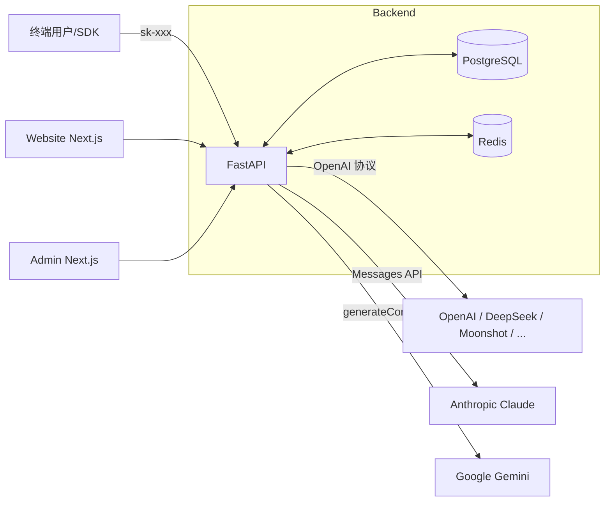

# 架构

## 拓扑



## 组件职责

- **website**：用户端。注册/登录、套餐购买、充值、API Key 管理、用量与账单查看。
- **admin**：管理端。用户/订单管理、上游通道、模型与倍率、套餐、路由策略、统计。
- **api**：唯一后端。
  - 鉴权：邮箱+密码 + JWT；调用 `/v1/*` 时用 `sk-` API Key 鉴权。
  - **转发**：对外暴露 OpenAI 兼容协议；内部通过 `services/providers/*` 把请求翻译成上游原生协议，把响应（含 SSE）翻译回 OpenAI 格式。
  - 计费：按 `models.prompt_rate / completion_rate` 倍率换算成 `cost_cents`，事务内扣 `users.balance_cents`。
  - 路由：根据 `route_policies` 选 `models`（weighted / fallback；smart 退化为 weighted）。
  - 限流：Redis 维护分钟桶。

## Provider 适配层

`api/app/services/providers/`：

| 模块 | 上游协议 | 适用 |
|---|---|---|
| `openai.py`    | `POST /v1/chat/completions`             | OpenAI 官方，及一切 OpenAI 兼容服务（DeepSeek、Moonshot、Qwen 兼容模式、OneAPI、自托管 vLLM 等） |
| `anthropic.py` | `POST /v1/messages` + `x-api-key` header | Claude 3/3.5/4 |
| `gemini.py`    | `POST /v1beta/models/{m}:generateContent?key=` | Gemini 1.5/2.x |

每个 adapter 都实现：
- `chat(channel, upstream_model, payload, stream)` → 返回 `ChatResult{status, body, stream, prompt_tokens, completion_tokens}`，stream 模式的 SSE 输出始终是 **OpenAI chat.completion.chunk 格式**，便于直接被 OpenAI SDK 消费。
- `embeddings(channel, upstream_model, payload)` → OpenAI / Gemini 实现；Anthropic 返回 501。

`registry.py` 根据 `channel.provider_type` 选 adapter。
`router.py` 实现 `select_route(policy, models, channels)`，weighted / fallback 顺序决定首选 + fallback 链。

## 数据库表

| 表 | 说明 |
|---|---|
| users | 用户与管理员，含余额 |
| api_keys | 用户的 sk- 密钥（hash 存储） |
| plans / subscriptions / orders | 套餐与订单 |
| channels | 上游账号 (`provider_type` ∈ {openai, anthropic, gemini}) |
| models | 可售卖模型 + 倍率 (`channel_id`, `upstream_model`, `prompt_rate`, `completion_rate`) |
| route_policies | 用户可见模型 → 实际模型 的路由策略 |
| usage_logs | 每次调用流水 |
| balance_tx | 余额变动流水 |

## 路由策略

- `weighted` — 按 targets 的 weight 加权随机；失败自动 fallback 到链中下一个
- `fallback` — 按 fallback_order 顺序兜底
- `smart` — 当前等价 `weighted`（保留枚举以便未来接入更复杂选型）

## 计费

```
cost_cents = ceil((prompt_tokens * prompt_rate + completion_tokens * completion_rate) / 10_000_000)
```

rate 单位：**微分 / 1K tokens**（1 分 = 10000 微分）。例：`prompt_rate=1500` ≈ $0.00015 / 1K tokens（按 7.1 汇率约 ¥0.0011 / 1K）。

## 支付

抽象接口 `services/payment/base.py:PaymentProvider`，三套 stub：`alipay.py` / `wechat.py` / `stripe.py`。
回调统一走 `POST /api/v1/payments/{channel}/callback`，dev 环境可访问 `/mock-pay` 模拟到账。
